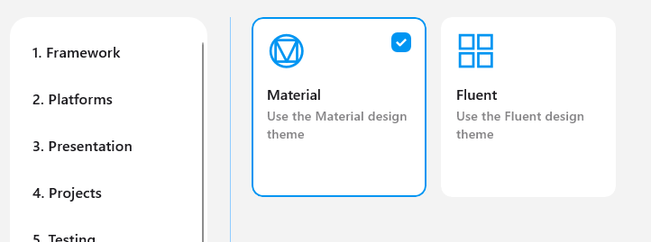

# Using the DSP Tooling in Uno.Material

## Introduction

Is it possible to automate the creation of the Material Design color palette? Yes, it is. Uno.Material provides a tooling to generate the color palette from the official Material Design color palette. This tooling is available in the [Uno.Dsp.Cli](https://nuget.org/packages/Uno.Dsp.Cli) and [Uno.Dsp.Tasks](https://nuget.org/packages/Uno.Dsp.Tasks) NuGet packages. The following instructions will cover the Uno.Dsp.Tasks version, which is more automatic.

> [!NOTE]
> Make sure you are referencing the generated XAML file in your
> application's `App.xaml` file, as shown in the following example:
>
> ```xml
>  <MaterialTheme xmlns="using:Uno.Material"
>                 ColorOverrideSource="ms-appx:///PROJECT_NAME/Styles/Application/MaterialColorsOverride.xaml" />
> ```
>
> More details [In the _Manual Color Overrides_ section of the Getting Started page](xref:uno.themes.material.getstarted)

## The Uno.Dsp.Tasks NuGet package

This package will be automatically present in the project after [creating a new Uno Platform project](https://aka.platform.uno/get-started) specifying the _Material_ theme. It is also possible to add it manually to an existing Uno Platform project by adding the following line to the _PackageReference_ section of the _csproj_ file:

* Add a nuget package reference:

   ```xml
   <PackageReference Include="Uno.Dsp.Tasks" Version="[latest version]" />
   ```

* The package is already present when you select _Material_ theme during project creation:
   

## Generating a custom color palette and export as JSON file

1. Navigate to the [Material Theme Builder](https://m3.material.io/theme-builder#/custom) and select the colors you want to use for your application.
2. Locate the _Export_ button and pick the _Material Theme (JSON)_ format.

    
3. Save the file to your computer.
4. Replace the file `ColorPaletteOverride.json` in the `Styles` folder of your application project with the one you just downloaded.
5. Build your application. The `ColorPaletteOverride.xaml` file will be automatically updated with the colors present in the JSON file.

## More flexibility

This will generate the file at each build, potentially overriding any changes you made to the file. If you want to keep it that way, you can simply remove the `ColorPaletteOverride.json` file from the `Styles` folder, the file won't get overwritten anymore.

Alternatively, you can also use the [Uno.Dsp.Cli](https://nuget.org/packages/Uno.Dsp.Cli) package to generate the file from the command line. This will allow you to generate the file only when you want to, and not at each build.

> [!TIP]
> Besides **Material Theme Builder Tool** doesn't export anymore **Material Tokens (DSP)** packages, Uno Plugin still supports this file with no restriction.
> To be able to import DSP packages just follow the same steps described previously and save the downloaded dsp zip file as `ColorPaletteOverride.zip` in the `Styles` folder of your application project.
> Make sure to delete the `material-theme.json` file from `Styles` folder before building your application, to avoid conflicts.